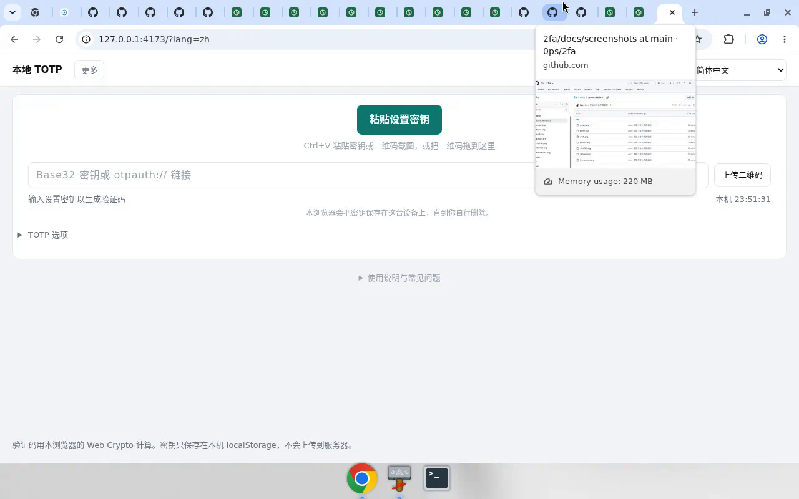
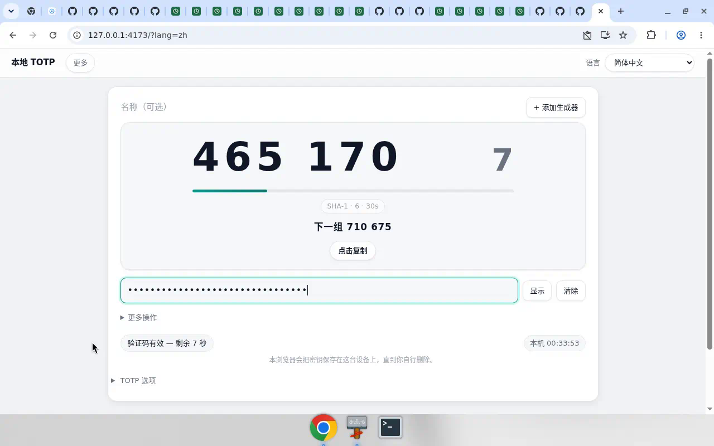
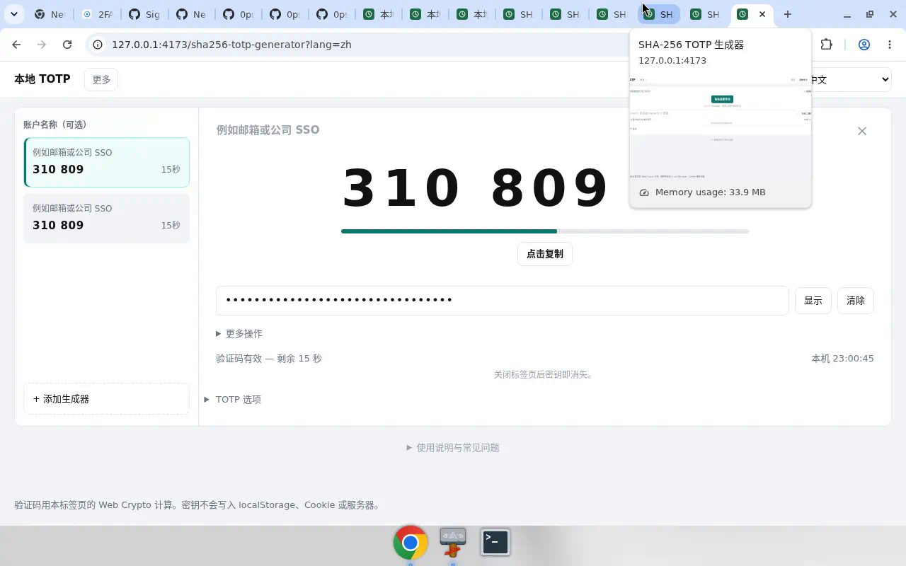
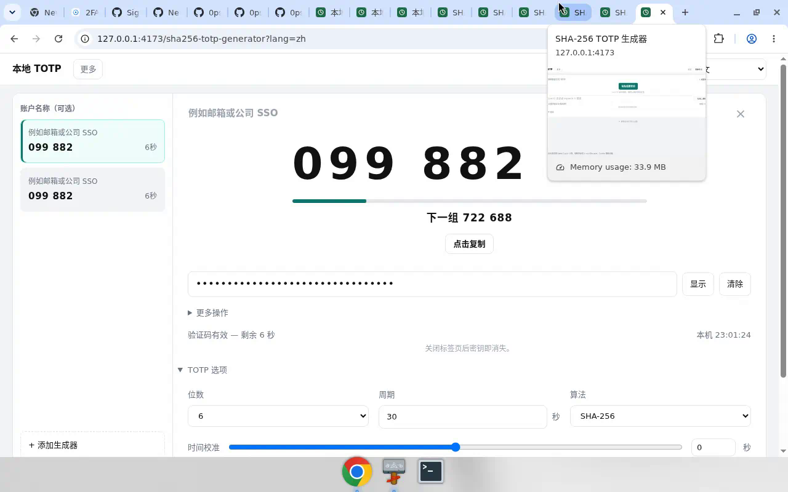
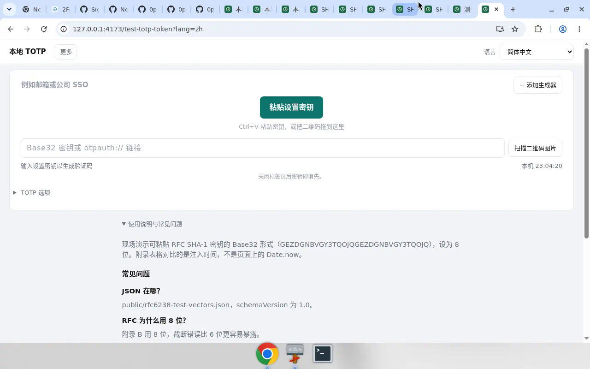
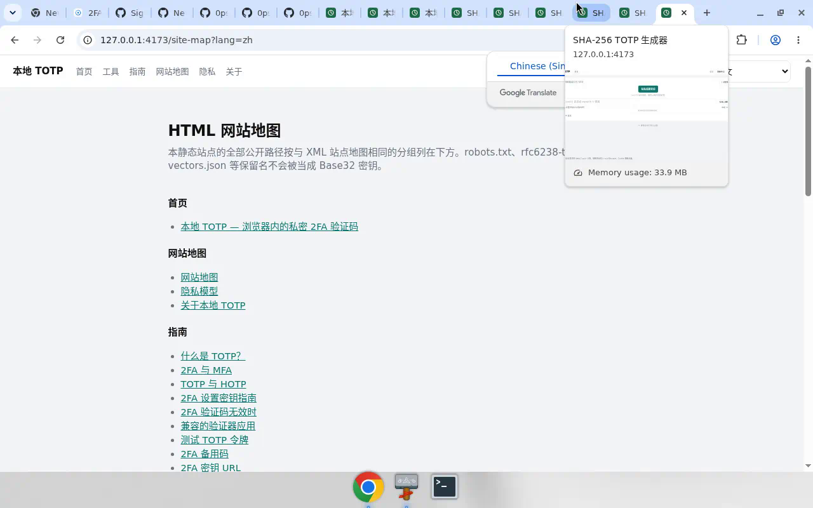
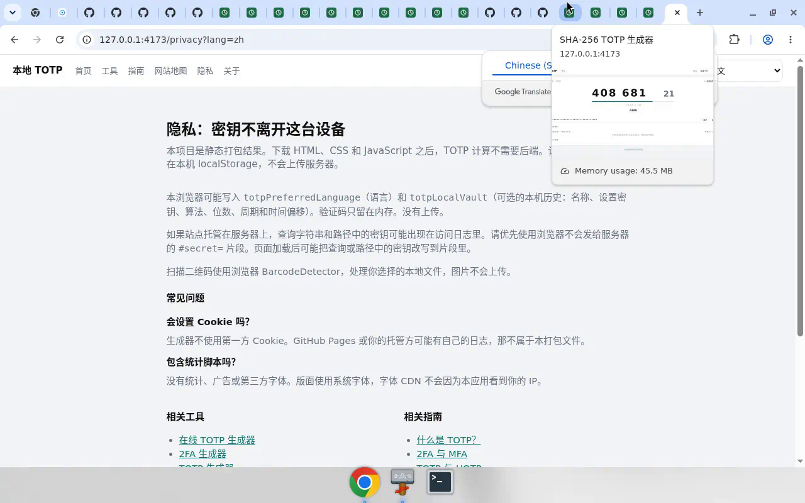

# 本地 TOTP / 2FA 生成器

浏览器里的一次性验证码工作台。[RFC 6238](https://www.rfc-editor.org/rfc/rfc6238) TOTP，HMAC 走本机 [Web Crypto](https://developer.mozilla.org/en-US/docs/Web/API/Web_Crypto_API)，没有账号、没有后端、没有广告。密钥不会上传。

打开就能 `Ctrl+V` 粘贴 Base32 或 `otpauth://`，也可以上传、拖入或粘贴二维码截图。验证码很大，点一下就复制。本浏览器用 `localStorage` 记住你加过的账号，关掉标签页再开还在，直到你自行清除。工作台卡片有圆角和轻阴影；空状态是虚线拖放区，粘贴是主按钮，上传二维码在下面。

在线：代码在 [github.com/0ps/2fa](https://github.com/0ps/2fa)。截图用的是 RFC 6238 附录 B 的公开演示密钥 `GEZDGNBVGY3TQOJQGEZDGNBVGY3TQOJQ`，不是真实账号。

## 界面预览

虚线拖放区，主按钮「粘贴设置密钥」，次按钮「上传二维码」。卡片圆角带阴影，不撑满一屏。

验证码在凸起的代码板上，旁边大号倒计时。最后 10 秒预告下一组，最后 5 秒板面变暖色。密钥自动隐藏。

同一个页面可以加多个互不干扰的生成器。上传多张二维码会一次加上多个账号，重复密钥会跳过。

SHA-256 落地页默认就是 SHA-256。位数、周期、算法、时间校准收在「TOTP 选项」里。最后几秒会预告下一组码。

用公开测试向量核对实现是否和 RFC 6238 一致。

全部工具页和指南的 HTML 站点地图。

隐私说明：密钥只留在本机浏览器，不进 Cookie、不上传服务器。

## 功能

- **粘贴即用**：打开页面即可 `Ctrl+V` / `Cmd+V`（不必先点输入框）。识别 Base32、多行密钥、`otpauth://` 链接（secret、算法、位数、周期、issuer）
- **二维码**：上传多张图片、拖放、剪贴板截图，都在浏览器里用 `BarcodeDetector` 解码，不上传。当前卡片没密钥就填进去，已有密钥就新加一张；规范化后重复的密钥跳过。浏览器支持时也可用摄像头扫码
- **大号验证码**：分组显示，旁边是大号剩余秒数。点验证码或「点击复制」。贴上密钥、扫码成功、周期翻到下一组时自动复制。最后 10 秒预告下一组（≤5 秒更醒目）；最后 2 秒复制的是下一组。键盘：未在输入框时 `v` 粘贴、`c` 复制、`n` 添加、`j`/`↓` 下一个、`k`/`↑` 上一个。
- **界面**：圆角与分层阴影、粘贴主按钮 / 上传次按钮、拖入时虚线区高亮、验证码板可点复制（复制成功有提示）。
- **本机历史**：刷新或关掉标签页后再打开，账号还在，并记住上次选中的账号。空密钥不入库。可在「更多操作」里「清除本机记录」
- **多生成器**：同一页多张卡片，参数互不影响。`n` 添加，`c` 复制当前码
- **搜索与置顶**：两个及以上账号时，左侧可「搜索账号」。常用账号可「置顶」，刷新后仍在最前。
- **本机备份**：「更多操作」里「导出备份」下载 JSON（`totp-backup.json`，不上传）；「导入备份」与本机记录合并，重复密钥跳过（已有记录时会确认）。
- **参数**：SHA-1 / SHA-256 / SHA-512，6 或 8 位，周期 10–120 秒。时间校准 ±90 秒。右下角有本机时钟，方便对照手机
- **落地页**：`/sha256-totp-generator` 等路径带各自默认算法/位数；指南和 FAQ 收在生成器页的「使用说明」
- **快捷填入**：优先 URL `#secret=`（不会进访问日志），也支持 query 和非保留路径，加载后尽量改写到 fragment
- **导出**：复制当前或全部 `otpauth://` 链接，显示给手机扫的二维码（`qrcode` 在本地画图）
- **21 种语言**（含简体/繁体中文），阿拉伯语 RTL。语言记在本机
- robots、`llms.txt`、sitemap、PWA manifest

## 方案

这是一个 **local-first 静态站**，不是带账号的验证器服务。

1. **计算全在浏览器里。** Vite 打出的 HTML/CSS/JS 放到 GitHub Pages。下载之后，Base32 解码、HMAC、动态截断都不需要网络。没有 API、没有 cookie 会话。
2. **工作台是主界面。** 生成器页把文档收进折叠区，默认给你一张卡片：大验证码、倒计时、粘贴/上传。空卡片不撑满屏幕。
3. **本机保险箱，不上传。** 有密钥的卡片写入 `localStorage` 键 `totpLocalVault`，并镜像到 `sessionStorage` 键 `totpSessionCards`。字段：名称、密钥、算法、位数、周期、时间偏移、`pinned`；payload 还保存 `selectedSecret`。密钥按大写并去掉空格/连字符去重。全部清空时仍写入 `{cards:[], timeOffset}`，这样「清除」不会被旧 session 顶回来。备份是同一套 JSON 形状，只作为本机文件（`totp-backup.json`）导出/导入，不上传。
4. **加载顺序。** URL 引导（`#secret=` 等）优先占第一张卡片；否则用 local vault（有卡片时）；否则用 session；否则一张空卡片。从 local 载入时会同步到 session。
5. **二维码只走本地。** 文件/拖放/粘贴图片都进同一条 `decodeQrImage` → `applyDecodedSecret`。解码用浏览器 `BarcodeDetector`，图片不离开这台设备。填或加由「当前是否已有密钥 + 是否重复」决定。
6. **分享链接用 fragment。** `#secret=` 不会出现在服务器访问日志。query/path 形式为了兼容而存在，页面加载后会尽量改写到 hash。
7. **界面当产品做。** 工作台最大宽度约 920px，卡片 elevation + 16px 圆角；文档收进折叠区。空状态 hug 内容。

本站不冒充任何厂商验证器。登记 ChatGPT、Google、Microsoft 等账户仍应使用官方应用。这里是本地计算器，并说明这些应用实现的 TOTP 参数。

## 技术

| 层 | 实现 |
| --- | --- |
| 运行时 | 静态站点，Vite 7 + TypeScript。无后端 |
| 路由 | `src/routes.ts` 里的落地页/指南/工具页；生成器由 `src/generator.ts` 挂到带 `showGenerator` 的页面 |
| TOTP | `src/totp.ts`：RFC 6238 计数器（unix / period 的 8 字节大端）、`crypto.subtle` HMAC、动态截断 |
| 算法 | SHA-1 / SHA-256 / SHA-512；默认首页 SHA-1 + 6 位 + 30 秒 |
| Base32 | `src/base32.ts`，字母表 A–Z2–7，去掉空格、连字符和 padding |
| otpauth | `src/otpauth.ts` 解析/生成 `otpauth://totp/...` |
| 保险箱 | `src/vault.ts`：`loadVault` / `saveVault` / `normalizeSecret` / `fillOrAddAction` |
| 二维码识别 | 浏览器 [BarcodeDetector](https://developer.mozilla.org/en-US/docs/Web/API/BarcodeDetector)（`qr_code`） |
| 样式 | `src/styles.css`：`--radius` 12/16、`--shadow-sm/md/lg`、顶栏毛玻璃、验证码板与拖放区 |
| 测试 | Vitest；RFC 6238 附录 B 向量 `public/rfc6238-test-vectors.json` |

## 用法
- Ctrl+V / Cmd+V 粘贴 Base32 或 otpauth
- 拖二维码到虚线区；上传可多选，也可粘贴截图
- 点大号验证码复制；最后 10 秒预告下一组
- 两个及以上账号时，左侧可「搜索账号」；常用账号可「置顶」
- 键盘：未在输入框时 `v` 粘贴、`c` 复制、`n` 添加、`j`/`↓` 下一个、`k`/`↑` 上一个
- 更多操作 → 导出备份 / 导入备份（JSON，与本机记录合并）；清除本机记录

## 隐私
- 密钥写入 totpLocalVault，不上传
- 语言 totpPreferredLanguage
- 清除本机记录可清空
- 二维码本机解码；分享用 #secret=

## 本地开发
中文：?lang=zh。推送 main 发布 GitHub Pages。
